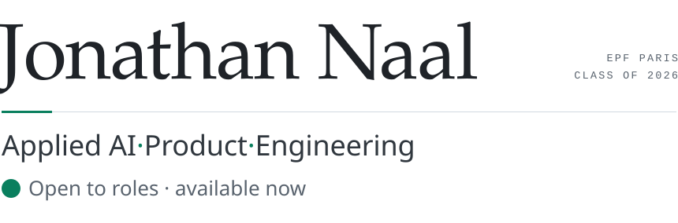
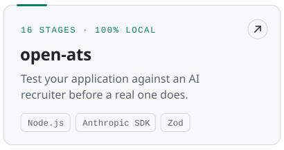
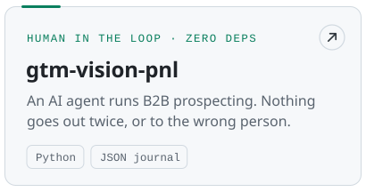
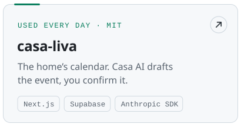
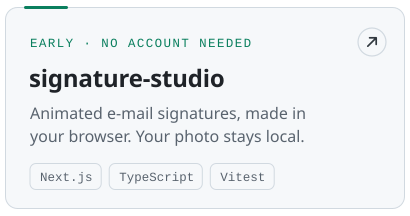
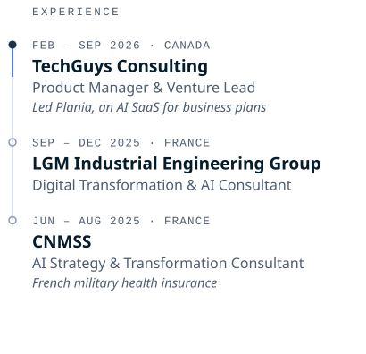
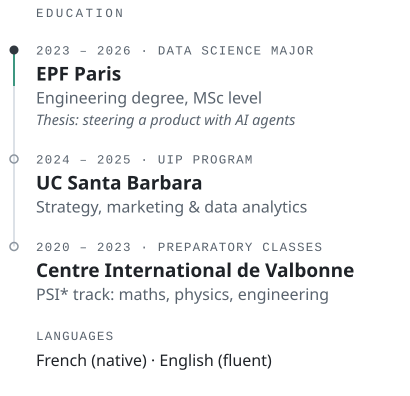

<picture><source media="(prefers-color-scheme: dark)" srcset="assets/banner-dark.svg"><source media="(prefers-color-scheme: light)" srcset="assets/banner-light.svg"></picture>

To keep it simple: I love building with AI, business, deep thinking, understanding how things work, and creating products people actually&nbsp;use.

**Engineering graduate, EPF Paris 2026.** Open to Applied AI, Product and Forward-Deployed roles. 
<samp>Paris, France</samp>

### How I work

<samp>01</samp>&ensp;**Map.** I draw the workflow; the people who run it correct it. 
<samp>02</samp>&ensp;**Build.** A working prototype, fast. Agents propose, a human approves. 
<samp>03</samp>&ensp;**Ship or stop.** And I write down why. 
<samp>04</samp>&ensp;**Adopt.** I onboard people until it sticks.

### Selected work

<a href="https://github.com/spykernv/open-ats"><picture><source media="(prefers-color-scheme: dark)" srcset="assets/project-open-ats-dark.svg"><source media="(prefers-color-scheme: light)" srcset="assets/project-open-ats-light.svg"></picture></a>
<a href="https://github.com/spykernv/gtm-vision-pnl"><picture><source media="(prefers-color-scheme: dark)" srcset="assets/project-gtm-vision-pnl-dark.svg"><source media="(prefers-color-scheme: light)" srcset="assets/project-gtm-vision-pnl-light.svg"></picture></a>
<a href="https://github.com/spykernv/casa-liva"><picture><source media="(prefers-color-scheme: dark)" srcset="assets/project-casa-liva-dark.svg"><source media="(prefers-color-scheme: light)" srcset="assets/project-casa-liva-light.svg"></picture></a>
<a href="https://github.com/spykernv/signature-studio"><picture><source media="(prefers-color-scheme: dark)" srcset="assets/project-signature-studio-dark.svg"><source media="(prefers-color-scheme: light)" srcset="assets/project-signature-studio-light.svg"></picture></a>

### Stack

<samp>AI&nbsp;&nbsp;&nbsp;</samp>&ensp;Claude&nbsp;Code&nbsp;· MCP&nbsp;servers&nbsp;· Claude&nbsp;Skills&nbsp;· Anthropic&nbsp;SDK&nbsp;· ElevenLabs 
<samp>BUILD</samp>&ensp;TypeScript&nbsp;· Python&nbsp;· Node.js&nbsp;· Next.js&nbsp;· React&nbsp;· Tailwind&nbsp;CSS 
<samp>SHIP&nbsp;</samp>&ensp;Supabase&nbsp;· Vercel&nbsp;· Cloudflare&nbsp;· Google&nbsp;Cloud&nbsp;· PostHog

### Path

<picture><source media="(prefers-color-scheme: dark)" srcset="assets/path-work-dark.svg"><source media="(prefers-color-scheme: light)" srcset="assets/path-work-light.svg"></picture>
<picture><source media="(prefers-color-scheme: dark)" srcset="assets/path-study-dark.svg"><source media="(prefers-color-scheme: light)" srcset="assets/path-study-light.svg"></picture>

### Contact

<samp>LINKEDIN</samp>&ensp;[in/jonathannaal](https://www.linkedin.com/in/jonathannaal)

<picture><source media="(prefers-color-scheme: dark)" srcset="assets/footer-dark.svg"><source media="(prefers-color-scheme: light)" srcset="assets/footer-light.svg"></picture>
