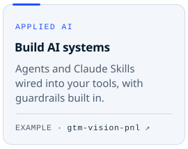
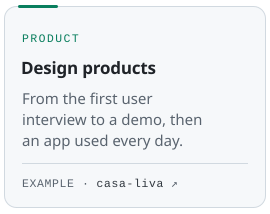
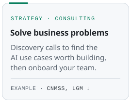
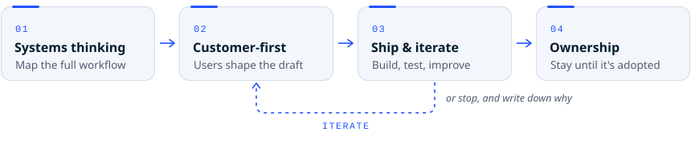

<picture></picture>

**AI × Product × Business.** Your business problem first, then the product, then the&nbsp;AI.

<picture><source media="(prefers-color-scheme: dark)" srcset="assets/divider-dark.svg"><source media="(prefers-color-scheme: light)" srcset="assets/divider-light.svg"></picture>

### What I can build for you

<a href="https://github.com/spykernv/gtm-vision-pnl"><picture><source media="(prefers-color-scheme: dark)" srcset="assets/pillar-build-dark.svg"><source media="(prefers-color-scheme: light)" srcset="assets/pillar-build-light.svg"></picture></a>
<a href="https://github.com/spykernv/casa-liva"><picture><source media="(prefers-color-scheme: dark)" srcset="assets/pillar-product-dark.svg"><source media="(prefers-color-scheme: light)" srcset="assets/pillar-product-light.svg"></picture></a>
<a href="#where-i-came-from"><picture><source media="(prefers-color-scheme: dark)" srcset="assets/pillar-business-dark.svg"><source media="(prefers-color-scheme: light)" srcset="assets/pillar-business-light.svg"></picture></a>

<picture><source media="(prefers-color-scheme: dark)" srcset="assets/divider-dark.svg"><source media="(prefers-color-scheme: light)" srcset="assets/divider-light.svg"></picture>

### How I think & work

<picture><source media="(prefers-color-scheme: dark)" srcset="assets/method-dark.svg"><source media="(prefers-color-scheme: light)" srcset="assets/method-light.svg"></picture>

<samp>01</samp>&ensp;**Systems thinking.** I map your whole workflow before I automate any piece of it. 
<samp>02</samp>&ensp;**Customer-first.** The people who run the work shape the solution from day&nbsp;one. 
<samp>03</samp>&ensp;**Ship & iterate.** Prototype fast, test it on your real cases, improve. Or stop, and write down&nbsp;why. 
<samp>04</samp>&ensp;**Ownership.** I stay after launch: docs, fixes, onboarding, until your team runs it without&nbsp;me.

<picture><source media="(prefers-color-scheme: dark)" srcset="assets/divider-dark.svg"><source media="(prefers-color-scheme: light)" srcset="assets/divider-light.svg"></picture>

### Skills

<!-- skills:start -->

<samp>DEV &amp; AI</samp> 

<samp>PRODUCT &amp; OPERATIONS</samp> 

<!-- skills:end -->

<picture><source media="(prefers-color-scheme: dark)" srcset="assets/divider-dark.svg"><source media="(prefers-color-scheme: light)" srcset="assets/divider-light.svg"></picture>

### Where I came from

<picture><source media="(prefers-color-scheme: dark)" srcset="assets/path-work-dark.svg"><source media="(prefers-color-scheme: light)" srcset="assets/path-work-light.svg"></picture>
<picture><source media="(prefers-color-scheme: dark)" srcset="assets/path-study-dark.svg"><source media="(prefers-color-scheme: light)" srcset="assets/path-study-light.svg"></picture>

<picture><source media="(prefers-color-scheme: dark)" srcset="assets/divider-dark.svg"><source media="(prefers-color-scheme: light)" srcset="assets/divider-light.svg"></picture>

### Currently · Connect

Building Claude agents and Skills in public. **Have a workflow you'd like Claude to run?** Walk me through it, in French or English: I'll come back with a working&nbsp;demo.

`Discovery call` → `Demo & POC` → `Ship` → `Team adoption`

<a href="https://www.linkedin.com/in/jonathannaal"><picture><source media="(prefers-color-scheme: dark)" srcset="assets/connect-linkedin-dark.svg"><source media="(prefers-color-scheme: light)" srcset="assets/connect-linkedin-light.svg"></picture></a>
<picture><source media="(prefers-color-scheme: dark)" srcset="assets/connect-web-dark.svg"><source media="(prefers-color-scheme: light)" srcset="assets/connect-web-light.svg"></picture>

